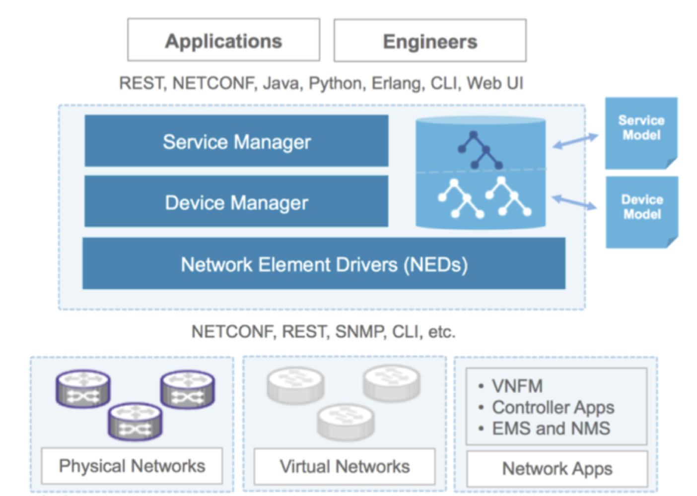

# NSO Hands on lab

- [NSO Hands on lab](#nso-hands-on-lab)
  - [NSO Documentation](#nso-documentation)
  - [NSO Overview](#nso-overview)
    - [Device Manager](#device-manager)
    - [Service Manager](#service-manager)
    - [Packages](#packages)
  - [NSO Installation](#nso-installation)
    - [Installation Prerequisites](#installation-prerequisites)
    - [Perform a local installation of NSO](#perform-a-local-installation-of-nso)
    - [Start NSO](#start-nso)
  - [Install and Load Cisco-IOS NEDs](#install-and-load-cisco-ios-neds)
  - [Create simulated network and devices](#create-simulated-network-and-devices)
  - [Add devices to NSO manually](#add-devices-to-nso-manually)
  - [Managing devices via NSO CLI](#managing-devices-via-nso-cli)
  - [Manage devices via NSO Python SDK](#manage-devices-via-nso-python-sdk)
  - [Loopback Service](#loopback-service)

---

## NSO Documentation

- Devnet Resources (including NSO and NEDs download)  
<https://developer.cisco.com/docs/nso/>  
- Learning Lab  
<https://developer.cisco.com/learning/lab/learn-nso-the-easy-way/step/1>  

---

## NSO Overview

NSO has two main layers: the Device Manager and the Service Manager. They serve different purposes but are tightly integrated into one transactional engine and database.



### Device Manager

- The purpose of the Device Manager is to manage different devices in a uniform and generic way.
- The NSO user or developer does not have to understand the underlying device CLI or similar.
- The Device Manager uses the Device Models written in YANG and provided by the Network Element Drivers, NEDs.
- NEDs abstract away the different protocols and APIs towards the devices.
- The NEDs are separate packages and every individual NED package is for a specific device OS.
- NEDs are released and delivered separately from the NSO platform itself.

### Service Manager

- The Service Manager lets you use and define service-aware applications, such as L2VPN, L3VPN that configure devices.
- Each service app is a package of its own and loaded to NSO.
- Services can be modified and re-loaded into a running system.
- The main parts of a service package are a YANG Service Model and a mapping definition towards the desired configurations.
- The Service Manager supports the full life-cycle for a service: creating, deleting, editing, etc. This comes from a patented built-in algorithm called FASTMAP, that is capable of deriving the minimum set of device configuration changes from one single mapping definition.
- The goal of a NSO service is to map the service model parameters to the device model parameters.

### Packages

- Service applications and NEDs are examples of packages that NSO loads.
- A package consists of YANG modules, code (written in python or java) and/or templates (xml).
- Packages are loaded by NSO at startup and can be added and upgraded at run-time
- A package is a controlled way of managing loading and versioning of custom applications.

---

## NSO Installation

### Installation Prerequisites

NSO supports Linux and OS X platforms.

- Java JDK-7.0 or higher is required.
- Python 2.7+ is required.

For package compilation and development :

- Apache ant
- GNU make

All the required packages are already installed.

Connect to **nso** host via SSH doing a right click on nso (in the left panel) then "Open remote SSG terminal"

There are 2 different types of NSO installation possible:

- Local Install (suported on Linux and OS X)

for Development, Evaluation, proof of concept and private lab purposes.

- System Install (supported only on Linux)

for production and system-wide deployment in a central location. The system install procedure needs root privileges. As part of System install, the NSO daemon ncs is started at boot time. System Install should be used only for production deployment. For all other purposes, use Local Install procedure.

### Perform a local installation of NSO

- Download the binaries

```
mkdir sources
cd sources
aws s3 cp s3://nso-training-data/ncs-5.8.2-cisco-ios-6.85.2.signed.bin ./
aws s3 cp s3://nso-training-data/nso-5.8.2.1.linux.x86_64.signed.bin ./
```

- Install NSO software in a specified directory

Unpack the NSO binary image
```
cisco@ubuntu:~$ sh $HOME/sources/nso-5.8.2.1.linux.x86_64.signed.bin
Unpacking...
Verifying signature...
Retrieving CA certificate from http://www.cisco.com/security/pki/certs/crcam2.cer ...
Successfully retrieved and verified crcam2.cer.
Retrieving SubCA certificate from http://www.cisco.com/security/pki/certs/innerspace.cer ...
Successfully retrieved and verified innerspace.cer.
Successfully verified root, subca and end-entity certificate chain.
Successfully fetched a public key from tailf.cer.
Successfully verified the signature of nso-5.5.linux.x86_64.installer.bin using tailf.cer
```

Run NSO installer script for Local Installation
``` console
cisco@ubuntu:~$ sh $HOME/sources/nso-5.8.2.1.linux.x86_64.installer.bin --local-install $HOME/ncs-5.8.2.1
INFO  Using temporary directory /tmp/ncs_installer.27656 to stage NCS installation bundle
INFO  Unpacked ncs-5.5 in /home/cisco/ncs-5.8.2.1
INFO  Found and unpacked corresponding DOCUMENTATION_PACKAGE
INFO  Found and unpacked corresponding EXAMPLE_PACKAGE
INFO  Found and unpacked corresponding JAVA_PACKAGE
INFO  Generating default SSH hostkey (this may take some time)
INFO  SSH hostkey generated
INFO  Environment set-up generated in /home/cisco/ncs-5.5/ncsrc
INFO  NSO installation script finished
INFO  Found and unpacked corresponding NETSIM_PACKAGE
INFO  NCS installation complete
```

_Obs. It is recommended to always include the version in the directory name._

- Set the environment variables

The installation program creates a shell script file named ncsrc in each NSO installation directory, which sets the environment variables. We need to source this file:

``` console
cd ~
source $HOME/ncs-5.8.2.1/ncsrc
```

 You may want to add this sourcing command to your login sequence, such as .consolerc or .profile or .bashrc.

``` console
cisco@ubuntu:~$ echo "source $HOME/ncs-5.8.2.1/ncsrc" >> .bashrc 
cisco@ubuntu:~$ cat .bashrc | grep source
# sources /etc/bash.bashrc).
source /home/cisco/ncs-5.8.2.1/ncsrc
```

- Create a runtime directory for NSO

We can have different runtime directories – where NSO keeps its DB, log files, packages, etc - which will allow to have completely separated NSO configurations and start the one is needed each time.

``` console
cisco@ubuntu:~$ ncs-setup --dest $HOME/ncs-run
```

This will create a ncs-run directory in the home directory, be sure to always start NSO from within that directory.

- Explore the contents of the ncs-run directory

``` console
cisco@ubuntu:~/$ ls -l ncs-run
total 36
drwxrwxr-x 2 cisco cisco  4096 Apr 20 02:25 logs
drwxrwxr-x 2 cisco cisco  4096 Apr 20 02:25 ncs-cdb
-rw-rw-r-- 1 cisco cisco 10021 Apr 20 02:25 ncs.conf
drwxrwxr-x 2 cisco cisco  4096 Apr 20 02:25 packages
-rw-rw-r-- 1 cisco cisco   621 Apr 20 02:25 README.ncs
drwxrwxr-x 4 cisco cisco  4096 Apr 20 02:25 scripts
drwxrwxr-x 2 cisco cisco  4096 Apr 20 02:25 state
```

The ncs.conf file is the configuration file loaded at startup by the ncs daemon.
The packages directory is used for the different services/NEDs which will be loaded by ncs. Installing a service or NED in NSO is done by just copying the directory containing the service  (or a tar.gz archive of it) in the packages folder.

### Start NSO

- Start the ncs daemon from within the runtime directory

``` console
cisco@ubuntu:~$ cd $HOME/ncs-run
cisco@ubuntu:~/ncs-run$ ncs
```

- You should be able to connect to NSO CLI

``` console
cisco@ubuntu:~/ncs-run$ ncs_cli -u admin -C

admin connected from 10.16.5.33 using ssh on ubuntu
admin@ncs#
admin@ncs# exit
cisco@ubuntu:~/ncs-run$
```

---

## Install and Load Cisco-IOS NEDs

- Unpack Cisco IOSXR NED binary image located in Downloads directory
  
``` console
cisco@ubuntu:~/ncs-run cd $HOME/sources
cisco@ubuntu:~/sources sh ./ncs-5.8.2-cisco-ios-6.85.2.signed.bin
Unpacking...
Verifying signature...
Retrieving CA certificate from http://www.cisco.com/security/pki/certs/crcam2.cer ...
Successfully retrieved and verified crcam2.cer.
Retrieving SubCA certificate from http://www.cisco.com/security/pki/certs/innerspace.cer ...
Successfully retrieved and verified innerspace.cer.
Successfully verified root, subca and end-entity certificate chain.
Successfully fetched a public key from tailf.cer.
Successfully verified the signature of ncs-5.8.2-cisco-ios-6.85.2.tar.gz using tailf.cer
```

And copy it in the NSO packages folder.
``` console
cisco@ubuntu:~/sources$ cp ncs-5.8.2-cisco-ios-6.85.2.tar.gz ~/ncs-run/packages/
```

- Connect to the NSO CLI using the ncs_cli utility

``` console
cisco@ubuntu:~/ncs-run$ ncs_cli -u admin -C

User admin last logged in 2021-04-20T02:27:07.425639-04:00, to ubuntu, from 10.16.5.33 using cli-ssh
admin connected from 10.16.5.33 using ssh on ubuntu
admin@ncs#
```

- Reload packages in NSO

``` console
admin@ncs# packages reload 

>>> System upgrade is starting.
>>> Sessions in configure mode must exit to operational mode.
>>> No configuration changes can be performed until upgrade has completed.
>>> System upgrade has completed successfully.
reload-result {
    package cisco-ios-cli-6.85
    result true
}
admin@ncs# 
```

- Verify that the packages are loaded

``` console
admin@ncs# show packages package oper-status 
                                                                                                      PACKAGE                
                        PROGRAM                                                                       META     FILE          
                        CODE     JAVA           PYTHON         BAD NCS  PACKAGE  PACKAGE  CIRCULAR    DATA     LOAD   ERROR  
NAME                UP  ERROR    UNINITIALIZED  UNINITIALIZED  VERSION  NAME     VERSION  DEPENDENCY  ERROR    ERROR  INFO   
-----------------------------------------------------------------------------------------------------------------------------
cisco-ios-cli-6.85  X   -        -              -              -        -        -        -           -        -      -      
   
```

---

## Create simulated network and devices

- Use ncs-netsim tool to create simulated devices based on NED

``` console
cisco@ubuntu:~/ncs-run$ cd ~/ncs-run
cisco@ubuntu:~/ncs-run$ ncs-netsim create-network ./packages/ncs-5.8.2-cisco-ios-6.85.2.tar.gz 3 simPE
DEVICE simPE0 CREATED
DEVICE simPE1 CREATED
DEVICE simPE2 CREATED
```


- Add other devices to the simulated network

``` console
cisco@ubuntu:~/ncs-run$ ncs-netsim add-to-network ./packages/ncs-5.8.2-cisco-ios-6.85.2.tar.gz 1 simCPE
DEVICE simCPE0 CREATED
```

- Start the simulation  

``` console
cisco@ubuntu:~/ncs-run$ ncs-netsim start
DEVICE simPE0 OK STARTED
DEVICE simPE1 OK STARTED
DEVICE simPE2 OK STARTED
DEVICE simCPE0 OK STARTED
```

- Import all Netsim devices to NSO

``` console
cisco@ubuntu:~/ncs-run$ ncs-netsim ncs-xml-init > netsim-devices.xml
cisco@ubuntu:~/ncs-run$ ncs_load -l -m ./netsim-devices.xml
```

> In case of you can delete the network simulation with the following command  
> `cisco@ubuntu:~/ncs-run$ ncs-netsim delete-network`

---

## Add devices to NSO manually

> The following can be used in case you need to add real or virtualised or netsim simulated devices in NSO manually

- Create another Netsim Device to be onboarded
  
``` console
cisco@ubuntu:~/ncs-run$ ncs-netsim add-to-network ./packages/ncs-5.8.2-cisco-ios-6.85.2.tar.gz 1 simCPE
DEVICE simCPE1 CREATED
cisco@ubuntu:~/ncs-run$ ncs-netsim start
```

- Note the address and CLI port to access the device

```
cisco@ubuntu:~/ncs-run$ ncs-netsim list | grep name=simCPE1
name=simCPE1 netconf=12026 snmp=11026 ipc=5014 cli=10026 dir=/home/cisco/ncs-run/netsim/simCPE/simCPE1 
```

- Create authgroup

The emulated devices use local authentication, so normally we would not need to perform any additional configuration steps for authentication. In a real environment, you would have to modify the authentication group default (i.e. authgroup default) or create a new authentication group where you would specify the credentials for NSO to use when connecting to devices (in our example we use authentication group named cml):

``` console
cisco@nso:~/ncs-run$ ncs_cli -u admin -C

admin connected from 10.55.2.3 using ssh on nso
admin@ncs# config
Entering configuration mode terminal
admin@ncs(config)# devices authgroups group netsim default-map remote-name admin remote-password admin remote-secondary-password admin
admin@ncs(config-group-netsim)# commit
Commit complete.
admin@ncs(config-group-netsim)# end 
admin@ncs# show running-config devices authgroups group netsim
devices authgroups group netsim
 default-map remote-name   admin
 default-map remote-password $9$CfU0n07br8n0AA/nRo5GrxajHTRhCm+1XSGCJXdprq8=
 default-map remote-secondary-password $9$j1/LIBGWo7GWNNPXyM0/jVcjUL0k2bP8Q0cEJdyPz40=
!
```

- Register devices into NSO

``` console
admin@ncs# config t
Entering configuration mode terminal
admin@ncs(config)# devices device simCPE1
admin@ncs(config-device-simCPE1)# address 127.0.0.1 port 10026
admin@ncs(config-device-simCPE1)# device-type cli ned-id cisco-ios-cli-6.85 protocol ssh
admin@ncs(config-device-simCPE1)# authgroup netsim
admin@ncs(config-device-simCPE1)# state admin-state unlocked
admin@ncs(config-device-simCPE1)# commit
Commit complete.
admin@ncs(config-device-simCPE1)# end
admin@ncs# devices fetch-ssh-host-keys device simCPE1
fetch-result {
    device simCPE1
    result updated
    fingerprint {
        algorithm ssh-rsa
        value dc:10:1a:1e:3c:18:1a:d8:70:23:fc:60:21:bc:1e:95
    }
}
```

- Sync-from

Once a device is registered to NSO and the ssh key has been fetched, a Sync-from can be done to retrieve all of the device configuration.

``` console
admin@ncs# devices device simCPE1 sync-from 
result true
```

---

## Managing devices via NSO CLI

- Display the devices

``` console
admin@ncs# show devices brief
NAME     ADDRESS       DESCRIPTION  NED ID                
--------------------------------------------------------
simCPE0  127.0.0.1     -            cisco-ios-cli-6.69    
simCPE1  127.0.0.1     -            cisco-ios-cli-6.69    
simPE0   127.0.0.1     -            cisco-iosxr-cli-7.33  
simPE1   127.0.0.1     -            cisco-iosxr-cli-7.33  
simPE2   127.0.0.1     -            cisco-iosxr-cli-7.33  
```

- Display devices configuration

```xml
admin@ncs# show running-config devices device simCPE1 | display xml
<config xmlns="http://tail-f.com/ns/config/1.0">
  <devices xmlns="http://tail-f.com/ns/ncs">
    <device>
      <name>simCPE1</name>
      <address>127.0.0.1</address>
      <port>10026</port>
      <ssh>
    ...
```

- Display devices configuration managed by the NED

```console
admin@ncs# show running-config devices device simCPE1 config 
devices device simCPE1
 config
  tailfned police cirmode
  no service password-encryption
  aaa accounting delay-start
  ...
  no ipv6 cef
  no dot11 syslog
  interface Loopback0
   ip address 127.0.0.1 255.0.0.0
   no shutdown
  exit
  interface Ethernet0/0/0
   no switchport
   no ip address
   no shutdown
  exit
```

- Display only devices Loopback 0 configuration

```console
admin@ncs# show running-config devices device simCPE1 config ios:interface Loopback 0
devices device simCPE1
 config
  interface Loopback0
   ip address 127.0.0.1 255.0.0.0
   no shutdown
  exit
 !
!
```

- Update devices Loopback 0 settings

```console
admin@ncs# config terminal
Entering configuration mode terminal
admin@ncs(config)# devices device simCPE1 config ios:interface Loopback 0
admin@ncs(config-if)# ip address 100.100.100.100 255.255.255.255
admin@ncs(config-if)# commit dry-run outformat native
native {
    device {
        name simCPE1
        data ! Generated offline
             interface Loopback0
              ip address 100.100.100.100 255.255.255.255
             exit
    }
}
admin@ncs(config-if)# commit dry-run
cli {
    local-node {
        data  devices {
                  device simCPE1 {
                      config {
                          ios:interface {
                              Loopback 0 {
                                  ip {
                                      address {
                                          primary {
             -                                address 127.0.0.1;
             +                                address 100.100.100.100;
             -                                mask 255.0.0.0;
             +                                mask 255.255.255.255;
                                          }
                                      }
                                  }
                              }
                          }
                      }
                  }
              }
    }
}
admin@ncs(config-if)# commit
Commit complete.
admin@ncs(config-if)# top
admin@ncs(config)# rollback configuration
admin@ncs(config)# commit dry-run
cli {
    local-node {
        data  devices {
                  device simCPE1 {
                      config {
                          ios:interface {
                              Loopback 0 {
                                  ip {
                                      address {
                                          primary {
             -                                address 100.100.100.100;
             +                                address 127.0.0.1;
             -                                mask 255.255.255.255;
             +                                mask 255.0.0.0;
                                          }
                                      }
                                  }
                              }
                          }
                      }
                  }
              }
    }
}
admin@ncs(config)# commit
Commit complete.
```

## Loopback service

For the purpose of this lab, we will create a NSO service that will provision a loopback interface on a device.

We will do it step by step, starting with the [base service](nso-base-service.md). 