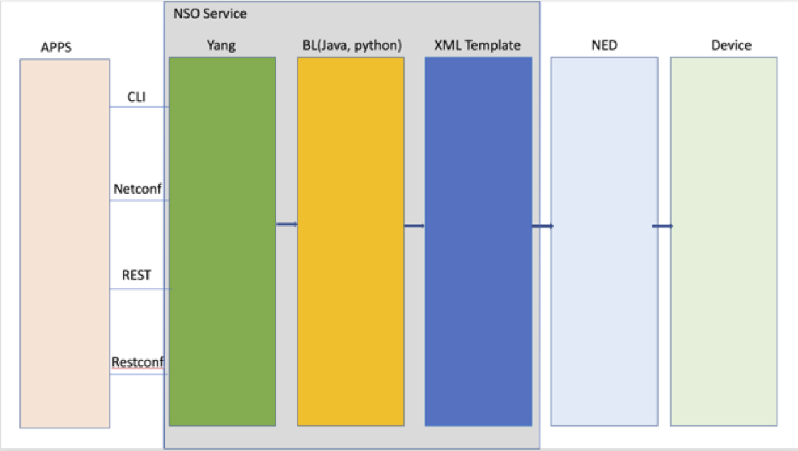

# NSO First Services Development

- [NSO First Services Development](#nso-first-services-development)
  - [NSO Packages](#nso-packages)
  - [Create a Template Service](#create-a-template-service)
    - [Bootstrap the Service files](#bootstrap-the-service-files)
    - [Edit the configuration template](#edit-the-configuration-template)
  - [Compile the service and reload packages](#compile-the-service-and-reload-packages)
  - [Configure Service](#configure-service)
  
A service application maps input parameters to create, modify, and delete a service instance into the resulting native commands to devices in the network.

The input parameters are given from a northbound system such as a self-service portal via API calls to NSO or a network engineer using any of the NSO User Interfaces such as the NSO CLI.

Usually implementing a service in NSO is reduced to transforming the input data structure (described in YANG) to device data structures (also described in YANG by the corresponding NED, capturing the configuration data that is supported by the device).

NSO reduces the need to create different logic for every possible change done to a service (create, delete, modify) to a single data-mapping definition for the create scenario. This is managed by the FASTMAP algorithm. Managing error scenarios is also reduced by the NSO built-in transaction manager.
  




---
<div style="page-break-after: always;"></div>

## NSO Packages

All user code that needs to run in NSO must be part of a package. A package is basically a directory of files with a fixed file structure.

A package consists of YANG modules, xml device configuration templates and java/python code, that are needed in order to add an application or function to NSO.

Each package consists of a number of components which are located in the package directory:

- The package-meta-data.xml file defines the package components to load by NSO.
- The src directory contains the source code for the package including the YANG model and the optional Java code.
- The python directory contains the optional Python code.
- The templates directory contains the XML configuration templates that are used to map service parameters to device configurations.

Depending on the use-case, an NSO package can contain:

- YANG models, xml configuration templates and no java/python code in case there is no logic needed for mapping the YANG model variables to the XML template variables.

> NOTE: If the xml configuration template is empty there will be no configuration changes on the network implied by the service. In this case NSO can be used as a database/inventory with a schema specified in the service  YANG models.

- YANG models and java or python code, without XML configuration templates. In this case all changes to the underlying device configurations is done directly from the code using the NSO provided API to manage the internal CDB.
- YANG models, xml configuration templates and java or python code for mapping the YANG model to the configuration templates.

<div style="page-break-after: always;"></div>

Combination of the 3 types defined above is possible, meaning that for example parts of a service are used just for inventory or saving needed data, parts of code are mapping the YANG variables to XML template variables and some other part of the code accesses directly the NSO structure.


| Yang Models | XML Templates | Python/Java Code | Usage |
| --- | --- | --- | --- |
| X | X | | Recomended A "simple" service with no difficult mapping logic or variable abstraction |
| X | X | X | Recomended A complete service, usage of code tends to promote and ease an higher intent abstraction |
| X | | X | Similar to previous option but all mapping logic is rendered using NSO SDK |

---

## Create a Template Service

Creating the different type of the packages with all the internal structure is facilitated by the ncs-make-package provided utility.

### Bootstrap the Service files

- Explore the ncs-make-package options

``` console
cisco@nso:~/ncs-run/packages$ ncs-make-package --help
```

The type of service skeletons that may be created are:

``` console
  ncs-make-package --service-skeleton TYPE package-name

      where TYPE is one of:
          java                  Java based service
          java-and-template     Java service with template
          python                Python based service
          python-and-template   Python service with template
          template              Template service (no code)
```

- Create a template service skeleton

> Be sure to be in the packages subdirectory

```bash
cisco@ubuntu:~/ncs-run/packages$ ncs-make-package --service-skeleton template loopback-service
```

- Inspect the directory structure of the loopback-service folder just created

```bash
cisco@ubuntu:~/ncs-run/packages$ tree loopback-service/
loopback-service/
├── package-meta-data.xml
├── src
│   ├── Makefile
│   └── yang
│       └── loopback-service.yang
├── templates
│   └── loopback-service-template.xml
└── test
    ├── internal
    │   ├── lux
    │   │   ├── basic
    │   │   │   ├── Makefile
    │   │   │   └── run.lux
    │   │   └── Makefile
    │   └── Makefile
    └── Makefile

7 directories, 9 files
```

> If tree is not installed, you can install it with `sudo apt-get install tree` command

loopback-service.yang is the service definition in YANG and loopback-service-template.xml is the configuration template that will be applied to write configuration on devices when service is deployed.

- Inspect the YANG service model

```yang
cisco@ubuntu:~/ncs-run/packages$ cat ./loopback-service/src/yang/loopback-service.yang 
module loopback-service {
  namespace "http://com/example/loopbackservice";
  prefix loopback-service;

  import ietf-inet-types {
    prefix inet;
  }
  import tailf-ncs {
    prefix ncs;
  }

  list loopback-service {
    key name;

    uses ncs:service-data;
    ncs:servicepoint "loopback-service";

    leaf name {
      type string;
    }

    // may replace this with other ways of refering to the devices.
    leaf-list device {
      type leafref {
        path "/ncs:devices/ncs:device/ncs:name";
      }
    }

    // replace with your own stuff here
    leaf dummy {
      type inet:ipv4-address;
    }
  }
}
```

loopback-service is a list with a name which is a string as well as the key of the list, a reference to a list of existing devices already on-boarded in NSO and a variable called dummy which is of type ipv4-address. For now we don't modify the service model but we edit the configuration template to use dummy input to write the IP address of the lookback on the devices referenced in the list.

- inspect the configuration template file

```xml
cisco@ubuntu:~/ncs-run/packages$ cat ./loopback-service/templates/loopback-service-template.xml 
<config-template xmlns="http://tail-f.com/ns/config/1.0"
                 servicepoint="loopback-service">
  <devices xmlns="http://tail-f.com/ns/ncs">
    <device>
      <!--
          Select the devices from some data structure in the service
          model. In this skeleton the devices are specified in a leaf-list.
          Select all devices in that leaf-list:
      -->
      <name>{/device}</name>
      <config>
        <!--
            Add device-specific parameters here.
            In this skeleton the service has a leaf "dummy"; use that
            to set something on the device e.g.:
            <ip-address-on-device>{/dummy}</ip-address-on-device>
        -->
      </config>
    </device>
  </devices>
</config-template>
```

---

### Edit the configuration template

As for NSO get started lab, we will use netsim simulated network devices to test our first services, and the required netsim simulation is already started

- Check you have the netsim network available

```console
cisco@ubuntu:~/ncs-run$ ncs-netsim list
ncs-netsim list for  /home/cisco/ncs-run/netsim

name=simPE0 netconf=12022 snmp=11022 ipc=5010 cli=10022 dir=/home/cisco/ncs-run/netsim/simPE/simPE0 
name=simPE1 netconf=12023 snmp=11023 ipc=5011 cli=10023 dir=/home/cisco/ncs-run/netsim/simPE/simPE1 
name=simPE2 netconf=12024 snmp=11024 ipc=5012 cli=10024 dir=/home/cisco/ncs-run/netsim/simPE/simPE2 
name=simCPE0 netconf=12025 snmp=11025 ipc=5013 cli=10025 dir=/home/cisco/ncs-run/netsim/simCPE/simCPE0 
name=simCPE1 netconf=12026 snmp=11026 ipc=5014 cli=10026 dir=/home/cisco/ncs-run/netsim/simCPE/simCPE1
```

> if the netsim network is not present please refer to the NSO get started lab to create and start the required simulation.

The XML templates used in service packages are called config templates. The templates reside in XML files, within a package. The templates can change any part of the configuration database (CDB) – you are not limited to configuring only devices, but other services as well.

NSO NEDs store the device configuration inside it’s Yang modelled database. In a nominal scenario NSO NED configuration and actual Device configuration must be the same - both DB are In-sync. NSO device layer has  built-in actions to pull (sync-from),  push (sync-to) and compare (compare-config) device configuration with locally stored NED configuration.  As we want to only capture a configuration template related to loopback configuration, make sure NSO is in-sync with the device we are going to configure.

- Sync-from device simCPE0 

``` console
admin@ncs# devices device simCPE0 sync-from 
result true
```

- Configure the simCPE0 with an IP address on interface Loopback 100 

``` console
cisco@ubuntu:~/ncs-run$ ncs-netsim cli-c simCPE0

admin connected from 10.16.11.1 using ssh on ubuntu
simCPE0# conf
Entering configuration mode terminal
simCPE0(config)# interface Loopback 100
simCPE0(config-if)# ip address 10.10.10.10 255.255.255.0
simCPE0(config-if)# commit
Commit complete.
simCPE0(config-if)# end
simCPE0# exit
```

- Compare the configuration changes from NSO database

```console
admin@ncs# devices device simCPE0 compare-config outformat xml
diff 
<devices xmlns="http://tail-f.com/ns/ncs">
  <device>
    <name>simCPE0</name>
    <config>
      <interface xmlns="urn:ios">
        <Loopback>
          <name>100</name>
          <ip>
            <address>
              <primary>
                <address>10.10.10.10</address>
                <mask>255.255.255.0</mask>
              </primary>
            </address>
          </ip>
        </Loopback>
      </interface>
    </config>
  </device>
</devices>
```

- Now that you have the XML output, you want to copy and paste just the bits between the config tags:

```xml
cisco@ubuntu:~/ncs-run/packages$ cat ./loopback-service/templates/loopback-service-template.xml 
<config-template xmlns="http://tail-f.com/ns/config/1.0"
                 servicepoint="loopback-service">
  <devices xmlns="http://tail-f.com/ns/ncs">
    <device>
      <!--
          Select the devices from some data structure in the service
          model. In this skeleton the devices are specified in a leaf-list.
          Select all devices in that leaf-list:
      -->
      <name>{/device}</name>
      <config>
        <interface xmlns="urn:ios">
          <Loopback>
            <name>100</name>
            <ip>
              <address>
                <primary>
                  <address>10.10.10.10</address>
                  <mask>255.255.255.0</mask>
                </primary>
              </address>
            </ip>
          </Loopback>
        </interface>
      </config>
    </device>
  </devices>
</config-template>
```

- Replace the hardcoded 100 value with the `{/dummy}` variable specified in the service model

```xml
cisco@ubuntu:~/ncs-run/packages$ cat ./loopback-service/templates/loopback-service-template.xml 
<config-template xmlns="http://tail-f.com/ns/config/1.0"
                 servicepoint="loopback-service">
  <devices xmlns="http://tail-f.com/ns/ncs">
    <device>
      <!--
          Select the devices from some data structure in the service
          model. In this skeleton the devices are specified in a leaf-list.
          Select all devices in that leaf-list:
      -->
      <name>{/device}</name>
      <config>
        <interface xmlns="urn:ios">
          <Loopback>
            <name>100</name>
            <ip>
              <address>
                <primary>
                  <address>{/dummy}</address>
                  <mask>255.255.255.0</mask>
                </primary>
              </address>
            </ip>
          </Loopback>
        </interface>
      </config>
    </device>
  </devices>
</config-template>
```

{/device} and {/dummy} are variables that will be instancied when the service is commited. The `/` in front of the variables name is the path, it indicates here that the variables are at the root of the service model.

>Note : The root of the service model is defined by the "ncs:servicepoint "XYZ" instruction in the Yang model. A service point can only be attached to a list or a container. Servicepoint cannot be nested, usually an NSO Service package defines a single servicepoint.

For specifying variables which will be filled directly from the YANG model we need to specify the XPATH needed to get the element from YANG – for example {/dummy}. If, instead, programatic mapping logic is used (java or python), then the variable name is used with the $ sign in front – for example {$DUMMY}.

---

## Compile the service and reload packages

- issue the make command from src directory to compile the Yang data model.

> TIP : You can specify the path of the service src folder with make '-C’ argument :
> `cisco@ubuntu:~/ncs-run/packages$ make -C loopback-service/src`

```bash
cisco@ubuntu:~/ncs-run/packages/loopback-service/src$ make
mkdir -p ../load-dir
/home/cisco/ncs-5.5/bin/ncsc  `ls loopback-service-ann.yang  > /dev/null 2>&1 && echo "-a loopback-service-ann.yang"` \
              -c -o ../load-dir/loopback-service.fxs yang/loopback-service.yang
```

- reload the packages from NSO

``` console
cisco@ubuntu:~/ncs-run$ ncs_cli -u admin -C

User admin last logged in 2021-04-30T03:10:54.472268-04:00, to ubuntu, from 10.16.11.1 using cli-ssh
admin connected from 10.16.11.1 using ssh on ubuntu
admin@ncs# packages reload

>>> System upgrade is starting.
>>> Sessions in configure mode must exit to operational mode.
>>> No configuration changes can be performed until upgrade has completed.
>>> System upgrade has completed successfully.
reload-result {
    package cisco-ios-cli-6.69
    result true
}
reload-result {
    package cisco-iosxr-cli-7.33
    result true
}
reload-result {
    package loopback-service
    result true
}
admin@ncs# 
System message at 2021-04-30 06:43:04...
    Subsystem stopped: ncs-dp-1-cisco-ios-cli-6.69:IOSDp
admin@ncs# 
System message at 2021-04-30 06:43:04...
    Subsystem started: ncs-dp-2-cisco-ios-cli-6.69:IOSDp
```

If there is no error detected by NSO in the YANG and XML files, the package loopback-service is loaded and ready to use.

> Note : The "Packages reload" command is a transactional action. In a multi-service environment, ALL packages MUST reload without error before you can test/use your service.

```
admin@ncs# show packages package * oper-status               
                                                                                                        PACKAGE                
                          PROGRAM                                                                       META     FILE          
                          CODE     JAVA           PYTHON         BAD NCS  PACKAGE  PACKAGE  CIRCULAR    DATA     LOAD   ERROR  
NAME                  UP  ERROR    UNINITIALIZED  UNINITIALIZED  VERSION  NAME     VERSION  DEPENDENCY  ERROR    ERROR  INFO   
-------------------------------------------------------------------------------------------------------------------------------
cisco-ios-cli-6.69    X   -        -              -              -        -        -        -           -        -      -      
cisco-iosxr-cli-7.33  X   -        -              -              -        -        -        -           -        -      -      
loopback-service      X   -        -              -              -        -        -        -           -        -      -    
```

---

## Configure Service

- make sure the devices are in sync

```console
admin@ncs# devices sync-from 
sync-result {
    device simCPE0
    result true
}
sync-result {
    device simCPE1
    result true
}
sync-result {
    device simPE0
    result true
}
sync-result {
    device simPE1
    result true
}
sync-result {
    device simPE2
    result true
}
```

- Configure the loopback-service on simCPE1

```console
admin@ncs# config
Entering configuration mode terminal
admin@ncs(config)# loopback-service 100 device simCPE1 dummy 1.1.1.1
admin@ncs(config-loopback-service-100)# commit dry-run 
cli {
    local-node {
        data  devices {
                  device simCPE1 {
                      config {
                          interface {
             +                Loopback 100 {
             +                    ip {
             +                        address {
             +                            primary {
             +                                address 1.1.1.1;
             +                                mask 255.255.255.0;
             +                            }
             +                        }
             +                    }
             +                }
                          }
                      }
                  }
              }
             +loopback-service 100 {
             +    device [ simCPE1 ];
             +    dummy 1.1.1.1;
             +}
    }
}
```

- commit the service configuration

```console
admin@ncs(config-loopback-service-100)# commit
Commit complete.
```

- check the simCPE1 configuration

```console
cisco@ubuntu:~/ncs-run$ ncs-netsim cli-c simCPE1

User admin last logged in 2021-04-30T06:52:27.048582-04:00, to ubuntu, from 127.0.0.1 using cli-ssh
admin connected from 10.16.11.1 using ssh on ubuntu
simCPE1# show running-config interface Loopback 100
interface Loopback100
 no shutdown
 ip address 1.1.1.1 255.255.255.0
exit
simCPE1# exit
```

- You can choose to rollback the service configuration

```console
admin@ncs(config)# commit dry-run 
cli {
    local-node {
        data  devices {
                  device simCPE1 {
                      config {
                          interface {
             -                Loopback 100 {
             -                    ip {
             -                        address {
             -                            primary {
             -                                address 1.1.1.1;
             -                                mask 255.255.255.0;
             -                            }
             -                        }
             -                    }
             -                }
                          }
                      }
                  }
              }
             -loopback-service 100 {
             -    device [ simCPE1 ];
             -    dummy 1.1.1.1;
             -}
    }
}
admin@ncs(config)# commit
Commit complete.
```

- check that the Loopback100 configuration doesn't exist after configuration rollback

```console
simCPE1# show running-config interface Loopback 100
---------------------------------------^
syntax error: unknown argument
```

## Enhanced Service

You can now move to the next step, the [enhanced service](nso-enhanced-service.md).