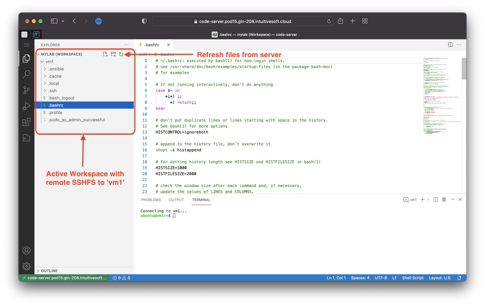

# Visual Studio Code

## Web Access

A Visual Studio Code server is available and accessible with the credentials and connection details provided in your lab access document :


Note : Chrome is recommended as the browser to unsure a better user experience.

### Usage

Once connected, on the left hand side you will find code-server navigation panel.
During your lab you might want to use :

* **File explorer** : The main panel this where you can edit/open remote files and terminals
* **Extensions manager** : The panel where you can install new vscode extensions.


The principal extensions used is SSHFS, it allows you to connect to remote VM using SSH and presents their filesystem in a graphical way.

In the `File Explorer` panel, you have a workspace called `MYLAB` already open with a remote connection to `vm1`. 
You can browse `vm1` filesystem and open / edit files. 

SSHFS extension does not provide automatic refresh, if files are created/modified directly on the target `vm1` they might not appears in the explorer. Press the `refresh` button to re-sync the remote SSHFS connection.




During your lab activity you might need to use command line interface to a remote host to execute commands.
You open a new terminal interface by :

1. Right click the host you want to connect to
2. Select `Open remote SSH Terminal`
3. Interact with terminal in the bottom pannel.


Note : You can have several terminals opened to the same host.

### Caveats

* Copy/Paste : on other browser than Chrome you might need to press `crtl + v` twice to paste.
* Refresh files : Do not forget to use the refresh files button.
* Multi-user edit : This is not a collaborative platform, changes from a user are not visible to other user until file is `saved` and `refreshed` by other users.
* Limited to non Microsoft extensions : only [open vsx extensions](https://open-vsx.org) are supported .

## Local

Download and install VS code from [https://code.visualstudio.com/download](https://code.visualstudio.com/download).

### Extensions

You can browse Microsoft extension marketplace using the extension panel.

To add the lab VMs we recommend usage of vscode native feature `remote explorer`.

Retrieve .pem and details of your VM in lab guide:


Add a new SSH target host in vscode.
1. Navigate to `Remote Explorer` panel
2. Click `plus` to add a new SSH Target
3. Enter the SSH 'cli' command in the VS code prompt
   * ```console
     ssh -i ~/.ssh/pod-key.pem ubunutu@vm1.pod15.gin-208.intuitivesoft.cloud
     ```


Once added connect to the SSH target host.

1. Right click the host
2. Select Connect to the Host in current Window


Once connected to the host you can open a workspace in the remote machine.
1. open the `File Explorer` panel
2. click `Open Folder`
3. Choose `/home/ubuntu`
4. Click `ok`


Once you are connected you can open a remote SSH conneciton to the target host using the menu.
1. Open `Terminal` menu 
2. Select `New Terminal`


